# How to Develop

## Procedure of developing an application

1. Download Olympus Camera Kit from <a href="http://dl-support.olympus-imaging.com/opc/en/" target="_blank">here</a>.
1. Try out the sample code.
	+ Let's try out a sample app in the Olympus Camera Kit.
	+ You can modify the sample application to make your original application. 
1. Install Library to your development environment.
	+ See setup guide [here](./preparation.html#setup).
	+ See also [setup technical note](./preparation.html#ios_technote) if you are iOS developer.

1. Develop an application referring to the API Reference and guideline.
   	+ If you install the application on an iOS device such as iPhone or iPad, you must become a member of the Apple Developer Program.
1. Publish your application. 
	+ See guide for [app publishing](../inquiry/publication.html) before publication.
      
## How to use the camera (over Wi-Fi network)
The camera must be connected to your device over Wi-Fi network before using an application written with Olympus Camera Kit. Here are some steps to connect the camera to your Wi-Fi terminal.

1. Power on the camera.
1. Automatically the camera works as a Wi-Fi access point.
1. Connect the camera to your Wi-Fi device such as smartphone or tablet using the setup screen of your device. 
1. Start the application on your Wi-Fi device.


NOTE) Olympus Camera Kit provides some APIs to connect OPC via Bluetooth Smart. These APIs work with Olympus' official application "OA.Central."

<a name="setup"></a>
## Library Setup
+ [Android](./preparation.html#lib_setup_android)
+ [iOS](./preparation.html#lib_setup_ios)

<a id="lib_setup_android"></a>
### Android
Olympus Camera Kit for Android is a Java Archive (JAR). Before developing a camera application, you must add JAR file to Android Studio and change the build settings. The following description assumes building an Android Studio project from scratch. You don't need to follow this procedure when you add a JAR file to an existing project. 

1. Open Android Studio.  Create a new empty project by selecting "Start a new Android Studio project" on the Welcome screen. Here make the application named HelloOLYCameraKit. Change company domain, project location, minimum SDK and activity settings according to your environment. This document skips the details of making a new project.


	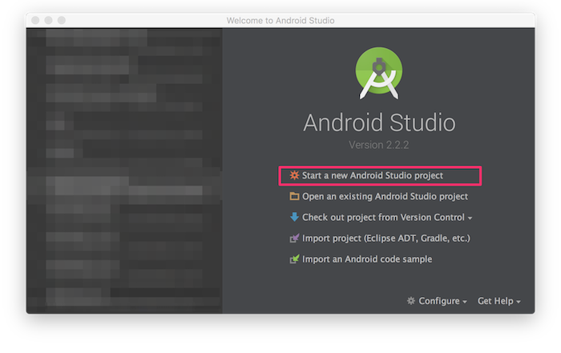

	
1. Display the Project Window (View > Tool Windows > Project) and select the project name (HelloOLYCameraKit.) Pop up context menu ( right click for Windows. Control+click for MacOS.), and select New > Directory. Label the directory "libs."


	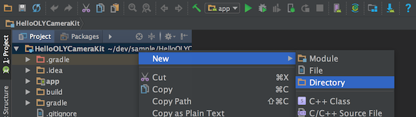


1. Copy Olympus Camera Kit JAR file (olycamerakit.jar) and paste it in the "libs" directory. Select OK for the dialog window to show copy destination. If you drag and drop the JAR file, it will be moved.

1. Confirm that JAR file has been copied into the libs folder. Select the JAR file, and display a context menu to select "Add As Library...."


	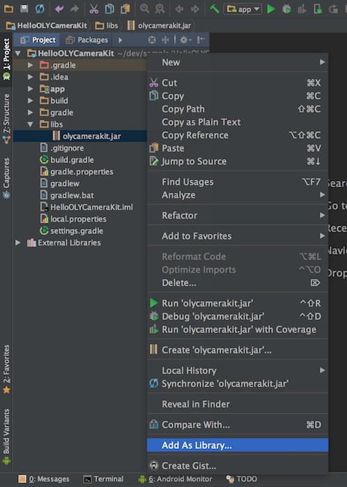

	

1. Select target module to link the JAR file, for example "app", and select OK.

1. See build.gradle file of target module and confirm the JAR file is added.  Select HelloOLYCameraKit > app > build.gradle on Project Window, then you can see the JAR file in a dependencies block.

1. Import the library to your application source code, e.g., Activity. If the library is imported correctly, Android Studio autocompletes the name of the imported library. Generate an OLYCamera object from the application source code, call an API method and operate the camera. However, **DO NOT generate multiple OLYCamera objects for one camera**. OLYCamera object must be a singleton object.

```
import jp.co.olympus.camerakit.*;

```

Now you are all done setting up Olympus Camera Kit for Android Studio.

<a name="lib_setup_ios"></a>
### iOS
The Olympus Camera Kit for iOS is a static framework. Before developing a camera application, you must add this framework to the Xcode project and change build settings. The following description assumes building a Xcode project from scratch. You don't need to follow this procedure when you add a framework to an existing project.


1. Open Xcode, and create a new empty project ( File > New > Project ). Here make a Single View Application named HelloOLYCameraKit. This document skips the details of making a new project.


	
	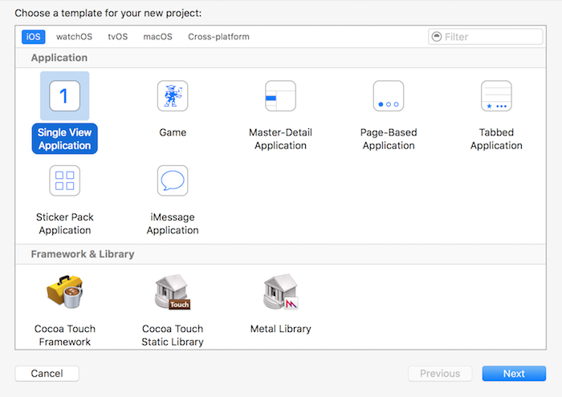
	
	

1. Display the Project Navigator ( View > Navigators > Show Project Navigator ) and select the project "HelloOLYCameraKit". Select "New Group" from the context menu (Control + Click). 


	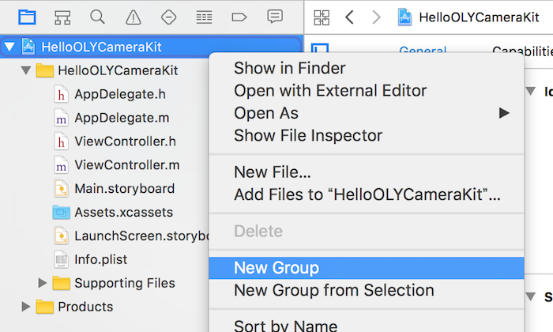

	
	
1. Confirm the new group (new folder) named "New Group" is generated, and rename it "Frameworks".
	


	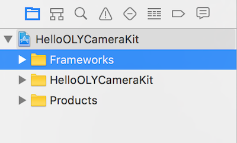

	
	
1. Display the Project Navigator ( View > Navigators > Show Project Navigator ), drag the OLYCameraKit.framework, and drop it in the "Frameworks" folder.


		
	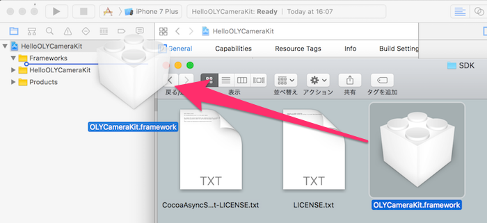
	
	

1. Check the following on the option dialog box. Then push the Finish button. 


	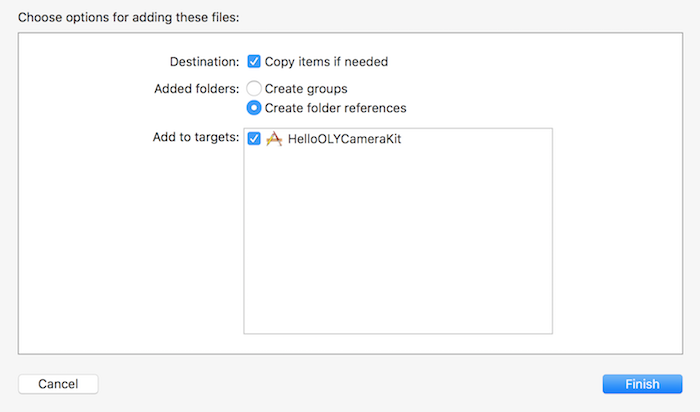

	

1. Check that the OLYCameraKit.framework has been added to the Frameworks folder.


	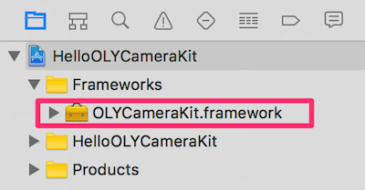

	


1. On selecting OLYCameraKit.framework, select "Show in Finder" from the context menu (Control + Click). Confirm the OLYCameraKit.framework has been copied to the same folder as the new project file.

1. Display the project navigator, and select the project (HelloOLYCameraKit). Select the target object in the editor area. Then click the "Build Phases" tab. Expand "Link Binary with Libraries" menu and press + button.

1. Add the following frameworks. 

	+ AudioToolbox.framework
	+ CFNetwork.framework
	+ ImageIO.framework
	+ SystemConfiguration.framework
	+ Foundation.framework
	+ CoreGraphics.framework
	+ UIKit.framework

		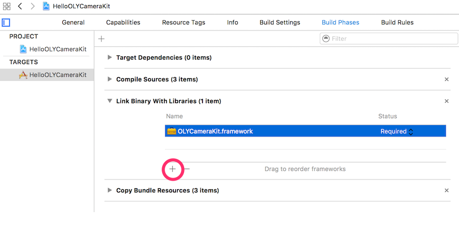
	

1. Select the HelloOLYCameraKit project in the project navigator, and add "-ObjC" parameter in the editor area ( Project > Build Settings > Linking > Other Linker Flags ). You can quickly find the target parameter by searching with keyword "other linker flags". **If you build without -ObjC settings, a run-time exception will occur when a method in OLYCamera class is called**.


	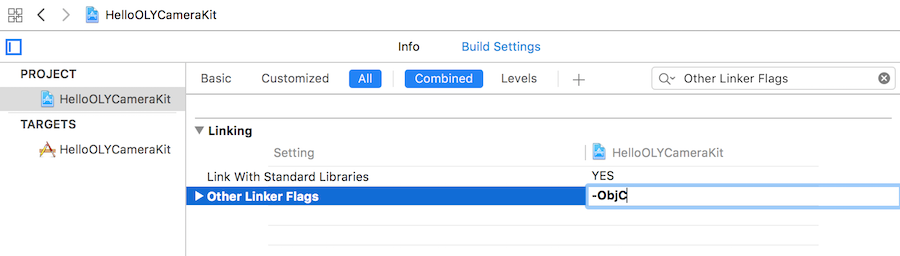

	

1. Import the framework to your application source code, e.g., AppDelegate. If the framework is imported correctly, Xcode autocompletes the name of the imported framework. Generate an OLYCamera object from the application source code, call an API method and operate the camera. However, **DO NOT generate multiple OLYCamera objects for one camera**. OLYCamera object must be a singleton object.

```
#import<OLYCameraKit/OLYCamera.h>
```

Now you are all done setting up Olympus Camera Kit for iOS.


<a id="ios_technote"></a>
## Setup Technical Note for iOS
### Settings for App Transport Security (ATS)			
Follow instructions below according to target iOS version.

* iOS10 or later			
	* No change needed			
			
* iOS9			
	* The camera cannot communicate with https.
	* Add "NSAppTransportSecurity" key to "info.plist" and disable ATS. The figure below shows more details.
	* info.plist can be edited in Xcode or text editor.

			
### Settings for Custom URL Scheme

* This setting is not mandatory. Custom URL Scheme is necessary when your app gets Bluetooth Smart settings from OA.Central, Olympus' official app.	
* Xcode 7 or later versions require a white list of URL scheme, which are permitted to receive and process.
* URL scheme is different in Japan and US. Add two URL schemes to your info.plist.
	* jp.olympus-imaging.oacentral
	* jp.olympus-imaging.oacentralus 
			
Here is part of info.plist after modifiying all above settings.
	
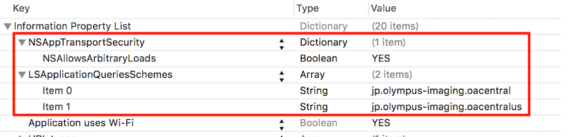
