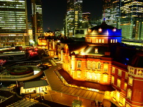
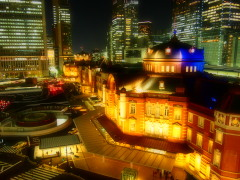
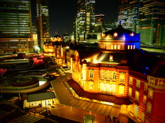
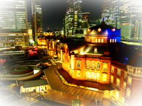
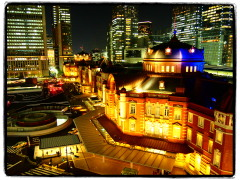
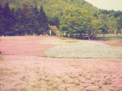
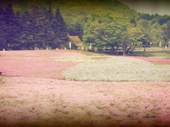

####Art Effects
**Overview**

+ Art Effects make Art Filters more fascinating by adding effects and emphasizing images and movies to express creativity beyond the photographer's imagination. 
+ Available effects vary with the selected filter.  Property of Art Effect is defined for every Art Filter.
+ These camera properties are valid if TAKEMODE is not ART and COLORTONE is set to a value related to art filter.

**Art Effect Type and Sample Image**

|  Art Effect |   Property Value   |                                 Description                                 |                       Sample                       |
|-------------|--------------------|-----------------------------------------------------------------------------|----------------------------------------------------|
| No Effect   | OFF                |                                                                             |      |
| Soft Focus  | FANTASIC_FOCUS     | Blur the focus while maintaining the core.                                       |  |
| Pin Hole    | TOY_PHOTO          | Reduce the brightness of the peripheral area.                                            |       |
| White Edges | WHITE_EDGE         | Defocus the four corners of the image in white.                 |      |
| Frame       | FRAME_JAGGY        | Add a stylish frame around the image.                                                 |           |
| Starlight   | STARLIGHT          | Produces an effective trace of light in a night scene etc.                                |       |
| Blur (TB)   | MINIATURE_VERTICAL | Gradually strengthens the top and bottom blurring at the focus point of origin.        |     |
| Blur (LR)   | MINIATURE_HORIZON  | Gradually strengthens the left and right blurring at the focus point of origin.       |     |
| Shade (LR)  | SHADING_VERTICAL   | Add bands of shadow on the left and right to make the image spread outward. |         |
| Shade (TB)  | SHADING_HORIZON    | Add bands of shadow on the top and bottom to make the image spread outward. |         |

**Supported Value for Each Property**

+ If cell is OK, corresponding property in rows can set corresponding value in columns.

|                    | 
Property Value
 | OFF | FANTASIC_FOCUS | TOY_PHOTO | WHITE_EDGE | FRAME_JAGGY | STARLIGHT | MINIATURE_VERTICAL | MINIATURE_HORIZON | SHADING_VERTICAL | SHADING_HORIZON |
|--------------------|-------------------------------------|-----|----------------|-----------|------------|-------------|-----------|--------------------|-------------------|------------------|-----------------|
| Art Filter         | Property Name                       |     |                |           |            |             |           |                    |                   |                  |                 |
| Pop Art            | ART_EFFECT_HYBRID_POPART            | OK  | OK             | OK        | OK         | OK          | OK        | OK                 | OK                | -                | -               |
| Soft Focus         | ART_EFFECT_HYBRID_FANTASIC_FOCUS    | OK  | -              | -         | OK         | -           | OK        | -                  | -                 | -                | -               |
| Pale & Light Color | ART_EFFECT_HYBRID_DAYDREAM          | OK  | OK             | OK        | OK         | OK          | OK        | OK                 | OK                | -                | -               |
| Light Tone         | ART_EFFECT_HYBRID_LIGHT_TONE        | OK  | -              | -         | -          | OK          | -         | OK                 | OK                | -                | -               |
| Grainy Film        | ART_EFFECT_HYBRID_ROUGH_MONOCHROME  | OK  | -              | OK        | OK         | OK          | -         | -                  | -                 | -                | -               |
| Pin Hole           | ART_EFFECT_HYBRID_TOY_PHOTO         | OK  | -              | -         | -          | OK          | -         | -                  | -                 | -                | -               |
| Diorama            | ART_EFFECT_HYBRID_MINIATURE         | OK  | -              | -         | -          | OK          | -         | -                  | -                 | -                | -               |
| Cross Process      | ART_EFFECT_HYBRID_CROSS_PROCESS     | OK  | OK-            | OK        | OK         | OK          | -         | OK                 | OK                | -                | -               |
| Gentle Sepia       | ART_EFFECT_HYBRID_GENTLE_SEPIA      | OK  | OK             | OK        | OK         | OK          | -         | OK                 | OK                | -                | -               |
| Dramatic Tone      | ART_EFFECT_HYBRID_DRAMATIC_TONE     | OK  | -              | OK        | OK         | OK          | OK        | OK                 | OK                | -                | -               |
| Key Line           | ART_EFFECT_HYBRID_LIGNE_CLAIR       | OK  | OK             | OK        | OK         | OK          | OK        | -                  | -                 | -                | -               |
| Watercolor         | ART_EFFECT_HYBRID_PASTEL            | OK  | OK             | OK        | OK         | OK          | -         | -                  | -                 | -                | -               |
| Vintage            | ART_EFFECT_HYBRID_VINTAGE           | OK  | OK             | OK        | OK         | OK          | OK        | OK                 | OK                | OK               | OK              |
| Partial Color      | ART_EFFECT_HYBRID_PARTCOLOR         | OK  | OK             | OK        | OK         | OK          | OK        | OK                 | OK                | -                | -               |
	

**Access Permission**

|   Wi-Fi    | Bluetooth Smart |
|------------|-----------------|
| Read/Write | Read/Write      |

**Supported Shooting Mode**

| iAuto | P  | A  | S  | M  | ART | movieP | movieA | movieS | movieM |
|-------|----|----|----|----|-----|--------|--------|--------|--------|
|       | OK | OK | OK | OK | OK  | OK     | OK     | OK     | OK     |

