####Art Filter Variations
**Overview**

+ Art Filter Variations allow users to customize each original filter with different moods and effects.
+ Each art filter has a different number of variations and some filters have no variations.
+ These camera properties are valid if TAKEMODE is not ART and COLORTONE is set to a value related to art filter.

**Art Filter Variations and Sample Images**

|                    |                            Original                            |                                                                                                                             TYPE I(or No Variation)                                                                                                                             |                                                            TYPE II                                                            |                                       TYPE III                                       |
|--------------------|----------------------------------------------------------------|--------------------------------------------------------------------------------------------------------------------------------------------------------------------------------------------------------------------------------------------------------------------------------|-----------------------------------------------------------------------------------------------------------------------------|-----------------------------------------------------------------------------------|
| Pop Art            |                                                                | Super-saturates colors, creating brighter, more vivid photographs.                                                                                                                                                                                                             | Fluorescent colors are less prominent than in Type I, but color contrast has been enhanced to create a more striking image. | NA                                                                                |
|                    |                      | 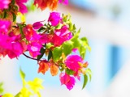                                                                                                                                                                                                                                     |                                                                                   |                                                                                   |
| Soft Focus         |                                                                | Creates a dreamlike quality giving photographs a surreal look.                                                                                                                                                                                                                 | NA                                                                                                                          | NA                                                                                |
|                    | 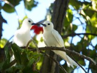     |                                                                                                                                                                                                                      |                                                                                                                             |                                                                                   |
| Pale & Light Color |                                                                | Brings soft, flat light and pastel coloring to photographs.                                                                                                                                                                                                                    | Type II is more reddish and overexposed than Type I                                                                         | NA                                                                                |
|                    | 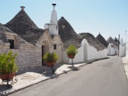                 |                                                                                                                                                                                                                                  |                                                                               |                                                                                   |
| Light Tone         |                                                                | Brightens the image, and its darker areas, providing more detail.                                                                                                                                                                                                              | NA                                                                                                                          | NA                                                                                |
|                    | 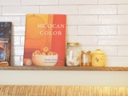             |                                                                                                                                                                                                                              |                                                                                                                             |                                                                                   |
| Grainy Film        |                                                                | Produces a gritty black-and-white film quality.                                                                                                                                                                                                                                | Type II has less contrast than Type I, optimizing the image's impact.                                                       | NA                                                                                |
|                    |  |                                                                                                                                                                                                                  |                                                               |                                                                                   |
| Pin Hole           |                                                                | Darkens the outer edges of a photograph, thereby enhancing the subject in the center and bringing the photograph to life.                                                                                                                                                      | The contrast is softened using more bluish hue than Type I.                                                                 | The contrast is softened using more reddish hue than Type I.                      |
|                    |                | 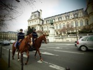                                                                                                                                                                                                                               |                                                                             |                                   |
| Diorama            |                                                                | Gives users a miniature model photo feeling by narrowing the depth of focus and enhancing color and contrast. Type I gradually strengthens the top and bottom blurring at the focus point of origin.                                                                           | Type II gradually strengthens the left and right blurring at the focus point of origin for portrait shots.                  | NA                                                                                |
|                    |                | 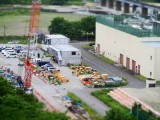                                                                                                                                                                                                                               |                                                                             |                                                                                   |
| Cross Process      |                                                                | Offers an unexpected look to images and videos by changing the color and contrast of subjects. Using this mode can result in surreal otherworldly images. Type I gives a cyan hue.                                                                                   | Type II gives a magenta hue.                                                                                                | NA                                                                                |
|                    | 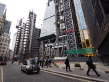       |                                                                                                                                                                                                                        |                                                                     |                                                                                   |
| Gentle Sepia       |                                                                | Gives your images and videos a soft, warm sepia cast similar to historical images from the early days of photography. The sepia tones are softer and the blacks are a true black, unlike traditional sepia images.                                                             | NA                                                                                                                          | NA                                                                                |
|                    |          | 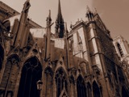                                                                                                                                                                                                                         |                                                                                                                             |                                                                                   |
| Dramatic Tone      |                                                                | Provides a daily landscape with a dramatic impression. It applies local changes in contrast to the image to represent the real space in a fictitious style by creating unrealistic tones of light and darkness.                                                                | Type II adds a monochromatic effect.                                                                                        | NA                                                                                |
|                    | 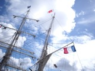       |                                                                                                                                                                                                                        |                                                                     |                                                                                   |
| Key Line           |                                                                | Enhances the edge lines of the image to make it look more like an illustration.                                                                                                                                                                                                | The edge lines are further emphasized than Type I.                                                                          | NA                                                                                |
|                    |            | 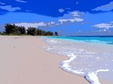                                                                                                                                                                                                                           |                                                                         |                                                                                   |
| Watercolor         |                                                                | Eliminates darker areas in the image to daringly represent bright color tones on a white canvas to express a world awash in color.                                                                                                                                             | Type II attenuates the contour lines so that contours are instead represented by gradations in color tone variation.        | NA                                                                                |
|                    |                      |                                                                                                                                                                                                                                      | 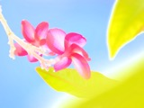                                                                                  |                                                                                   |
| Vintage            |                                                                | Gives a nostalgic expression to casual everyday scenes, transforming them into "a special photo that has stood the test of time.” Type I produces faded colors created when light leaks onto film.                                                                             | Type II produces faded colors to create the nostalgic feel of an old photograph.                                            | Type III produces softened tones for a sophisticated feel.                        |
|                    | 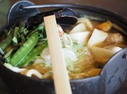                   | 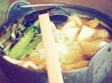                                                                                                                                                                                                                                   | 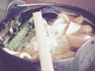                                                                                |                                       |
| Partial Color      |                                                                | Emphasizes a specific part of the photo, done by choosing one specific color and leaving all the rest in black and white. Makes your photographic subjects more impressive.Type I keeps colors in natural gradations based on the selected color making the subject stand out. | Type II maintains a small amount of color for the non-selected colors creating a unique effect.                             | Type III keeps only the selected color for a stronger emphasis of a single color. |
|                    | 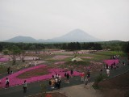               |                                                                                                                                                                                                                                |                                                                             |                                   |

**Property Value**

| Property Value| Description |
|---------------|-------------|
| TYPE1         | TYPE I      |
| TYPE2         | TYPE II     |
| TYPE3         | TYPE III    |

**Supported Value for Each Property**

+ If cell is OK, corresponding property in rows can set corresponding value in columns.

|                    | 
Property Value
 | TYPE1 | TYPE2 | TYPE3 |
|--------------------|-------------------------------------|-------|-------|-------|
| Art Filter         | Property Name                       |       |       |       |
| Pop Art            | ART_EFFECT_TYPE_POPART              | OK    | OK    | -     |
| Soft Focus         | -                                   | -     | -     | -     |
| Pale & Light Color | ART_EFFECT_TYPE_DAYDREAM            | OK    | OK    | -     |
| Light Tone         | -                                   | -     | -     | -     |
| Grainy Film        | ART_EFFECT_TYPE_ROUGH_MONOCHROME    | OK    | OK    | -     |
| Pin Hole           | ART_EFFECT_TYPE_TOY_PHOTO           | OK    | OK    | OK    |
| Diorama            | ART_EFFECT_TYPE_MINIATURE           | OK    | OK    | -     |
| Cross Process      | ART_EFFECT_TYPE_CROSS_PROCESS       | OK    | OK    | -     |
| Gentle Sepia       | -                                   | -     | -     | -     |
| Dramatic Tone      | ART_EFFECT_TYPE_DRAMATIC_TONE       | OK    | OK    | -     |
| Key Line           | ART_EFFECT_TYPE_LIGNE_CLAIR         | OK    | OK    | -     |
| Watercolor         | ART_EFFECT_TYPE_PASTEL              | OK    | OK    | -     |
| Vintage            | ART_EFFECT_TYPE_VINTAGE             | OK    | OK    | OK    |
| Partial Color      | ART_EFFECT_TYPE_PARTCOLOR           | OK    | OK    | OK    |

**Access Permission**

|   Wi-Fi    | Bluetooth Smart |
|------------|-----------------|
| Read/Write | Read/Write      |

**Supported Shooting Mode**

| iAuto | P  | A  | S  | M  | ART | movieP | movieA | movieS | movieM |
|-------|----|----|----|----|-----|--------|--------|--------|--------|
|       | OK | OK | OK | OK | OK  | OK     | OK     | OK     | OK     |

