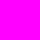

####Color Creator Hue
**Name and Function**

|    Property Name    |                                                                           Function                                                                           |
|---------------------|--------------------------------------------------------------------------------------------------------------------------------------------------------------|
| COLOR_CREATOR_COLOR | Hue for color creator   Color creator lets you adjust hue of the subject. This property is valid when COLORTONE property is set to COLOR_CREATOR. |

**Property Value**

| Property Value |        Description        |              Color Sample              |
|----------------|---------------------------|----------------------------------------|
|              0 | Hue Pattern 0 (No Effect) |  |
|              1 | Hue Pattern 1             |  |
|              2 | Hue Pattern 2             |  |
|              3 | Hue Pattern 3             |  |
|              4 | Hue Pattern 4             |  |
|              5 | Hue Pattern 5             |  |
|              6 | Hue Pattern 6             |  |
|              7 | Hue Pattern 7             |  |
|              8 | Hue Pattern 8             |  |
|              9 | Hue Pattern 9             |  |
|             10 | Hue Pattern 10            |  |
|             11 | Hue Pattern 11            |  |
|             12 | Hue Pattern 12            |  |
|             13 | Hue Pattern 13            |  |
|             14 | Hue Pattern 14            |  |
|             15 | Hue Pattern 15            |  |
|             16 | Hue Pattern 16            |  |
|             17 | Hue Pattern 17            |  |
|             18 | Hue Pattern 18            |  |
|             19 | Hue Pattern 19            |  |
|             20 | Hue Pattern 20            |  |
|             21 | Hue Pattern 21            |  |
|             22 | Hue Pattern 22            |  |
|             23 | Hue Pattern 23            |  |
|             24 | Hue Pattern 24            |  |
|             25 | Hue Pattern 25            |  |
|             26 | Hue Pattern 26            |  |
|             27 | Hue Pattern 27            |  |
|             28 | Hue Pattern 28            |  |
|             29 | Hue Pattern 29            |  |

**Access Permission**

|   Wi-Fi    | Bluetooth Smart |
|------------|-----------------|
| Read/Write | Read/Write      |

**Supported Shooting Mode**

| iAuto | P  | A  | S  | M  | ART | movieP | movieA | movieS | movieM |
|-------|----|----|----|----|-----|--------|--------|--------|--------|
|       | OK | OK | OK | OK | 	  | OK     | OK     | OK     | OK     |

####Color Creator Saturation
**Name and Function**

|    Property Name    |                                                                                  Function                                                                                  |
|---------------------|----------------------------------------------------------------------------------------------------------------------------------------------------------------------------|
| COLOR_CREATOR_VIVID | Saturation for color creator   Color creator feature lets you adjust saturation of the subject. This property is valid when COLORTONE property is set to COLOR_CREATOR. |

**Property Value**

| Property Value |  Description   |
|----------------|----------------|
|             -4 | Saturation -4  |
|             -3 | Saturation -3  |
|             -2 | Saturation -2  |
|             -1 | Saturation -1  |
|              0 | Saturation 0 |
|             +1 | Saturation +1  |
|             +2 | Saturation +2  |
|             +3 | Saturation +3  |

**Access Permission**

|   Wi-Fi    | Bluetooth Smart |
|------------|-----------------|
| Read/Write | Read/Write      |

**Supported Shooting Mode**

| iAuto | P  | A  | S  | M  | ART | movieP | movieA | movieS | movieM |
|-------|----|----|----|----|-----|--------|--------|--------|--------|
|       | OK | OK | OK | OK | 	  | OK     | OK     | OK     | OK     |

