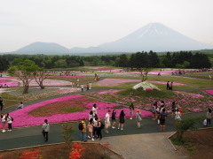
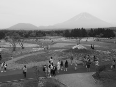
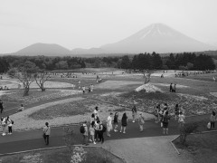
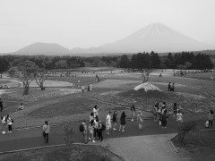
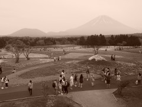
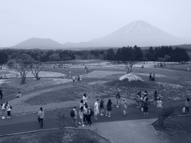
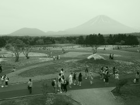

#### Processing Options for Picture Mode

**Overview**

+ Allow users to adjust processing options of picture mode including contrast, sharpness, saturation, gradation, and effect level.
+ Available options vary with the selected picture mode.

**Property Name**

+ Property name is string which combines property name prefix and suffix.
	+ Property name to adjust sharpness in Vivid picture mode:　SHARP_VIVID
	+ Property name to adjust tone (gradation) in Monotone picture mode:　TONE_MONOCHROME

Prefix

| Property Name Prefix |    Option    |
|----------------------|--------------|
| CONTRAST_            | Contrast     |
| SHARP_               | Sharpness    |
| SATURATION_LEVEL_    | Saturation   |
| TONE_                | Gradation    |
| EFFECT_LEVEL_        | Effect Level |

Suffix

| Property Name Suffix | Picture Mode |
|----------------------|--------------|
| I_FINISH             | i-Enhance    |
| VIVID                | Vivid        |
| NATURAL              | Natural      |
| FLAT                 | Muted        |
| SOFT                 | Portrait     |
| MONOCHROME           | Monotone     |

**Supported Options for Each Picture Mode**

+ If cell is OK, corresponding picture mode in rows can set corresponding option in columns.

| 
Option (Prefix)
 | CONTRAST_ | SHARP_ | SATURATION_ | TONE_ | EFFECT_LEVEL_ |
|-------------------------------------------|-----------|--------|-------------|-------|---------------|
| Picture Mode (Suffix)                     |           |        |             |       |               |
| I_FINISH                                  | OK        | OK     | OK          | OK    | OK            |
| VIVID                                     | OK        | OK     | OK          | OK    | -             |
| NATURAL                                   | OK        | OK     | OK          | OK    | -             |
| FLAT                                      | OK        | OK     | OK          | OK    | -             |
| SOFT                                      | OK        | OK     | OK          | OK    | -             |
| MONOCHROME                                | OK        | OK     | -           | OK    | -             |

**Property Value**

Contrast, Sharpness, Saturation (common)

| Property Value | Description |
|--------------|------|
|           -2 |   -2 |
|           -1 |   -1 |
|            0 |    0 |
|           +1 |   +1 |
|           +2 |   +2 |

Gradation

| Property Value |                                                                                                          Description                                                                                                          |
|---------------|-------------------------------------------------------------------------------------------------------------------------------------------------------------------------------------------------------------------------------|
| AUTO          | Divides the image into detailed regions and adjusts the brightness separately for each region. This is effective for images with areas of large contrast in which the whites appear too bright or the blacks appear too dark. |
| NORMAL        | Use this mode for general use.                                                                                                                                                                                               |
| HIGHKEY       | Gradation for a bright subject.                                                                                                                                                                                               |
| LOWKEY        | Gradation for a dark subject.                                                                                                                                                                                                 |

Effect Level

| Property Value | Description |
|--------------|------------------------|
| HIGH         | Strengthen the effect. |
| STANDARD     | Standard effect level. |
| LOW          | Weaken the effect.     |

**Access Permission**

|   Wi-Fi    | Bluetooth Smart |
|------------|-----------------|
| Read/Write | Read/Write      |

**Supported Shooting Mode**

| iAuto | P  | A  | S  | M  | ART | movieP | movieA | movieS | movieM |
|-------|----|----|----|----|-----|--------|--------|--------|--------|
|       | OK | OK | OK | OK | OK  | OK     | OK     | OK     | OK     |

#### Tone Control
**Name and Function**

|     Property Name    |              Function              |
|---------------------|------------------------------------|
| TONE_CONTROL_LOW    | Control exposure of dark part. |
| TONE_CONTROL_MIDDLE | Control exposure of middle part. |
| TONE_CONTROL_HIGH   | Control exposure of bright part. |

**Property Value**

Tone Control (Common)

| Property Value | Description |
|--------------|------|
|           -7 |   -7 |
|           -6 |   -6 |
|           -5 |   -5 |
|           -4 |   -4 |
|           -3 |   -3 |
|           -2 |   -2 |
|           -1 |   -1 |
|            0 |    0 |
|           +1 |   +1 |
|           +2 |   +2 |
|           +3 |   +3 |
|           +4 |   +4 |
|           +5 |   +5 |
|           +6 |   +6 |
|           +7 |   +7 |

**Access Permission**

|   Wi-Fi    | Bluetooth Smart |
|------------|-----------------|
| Read/Write | Read/Write      |

**Supported Shooting Mode**

| iAuto | P  | A  | S  | M  | ART | movieP | movieA | movieS | movieM |
|-------|----|----|----|----|-----|--------|--------|--------|--------|
|  OK  | OK | OK | OK | OK | OK |     |    |    |     |

#### Monochrome Filter Effect
**Overview**

+ This effect creates a black and white image and varies the contrast characteristics.
+ The filter color is brightened, and the complementary color is darkened.
+ This effect can be used with the settings below.
	+ Art Filter: Grainy Film (Type I, Type II)
	+ Art Filter: Dramatic Tone (Type II)
	+ Picture Mode: Monotone
+ These camera properties are valid if TAKEMODE is not ART and COLORTONE is set to a value related to art filter.

**Property Name**

|          Property Name          |           Traget          |
|---------------------------------|---------------------------|
| MONOTONEFILTER_MONOCHROME       | Picture Mode: Monotone    |
| MONOTONEFILTER_ROUGH_MONOCHROME | Art Filter: Grainy Film   |
| MONOTONEFILTER_DRAMATIC_TONE    | Art Filter: Dramatic Tone |

**Property Value**

| Property Value |                                       Description                                        |                   Sample Image                  |
|----------------|------------------------------------------------------------------------------------------|-------------------------------------------------|
|                |            Original Image                                                              |             |
| NORMAL         | Neutral Create a normal black and white image.                                        |  |
| YELLOW         | Yellow filter Reproduce clearly defined white cloud with natural blue sky.            |   |
| ORANGE         | Orange filter Slightly emphasize colors in blue skies and sunsets.                    |   |
| RED            | Red filter Strongly emphasize colors in blue skies and brightness of crimson foliage. |      |
| GREEN          | Green filter Strongly emphasize colors in red lips and green leaves.                  |    |

**Access Permission**

|   Wi-Fi    | Bluetooth Smart |
|------------|-----------------|
| Read/Write | Read/Write      |

**Supported Shooting Mode**

| iAuto | P  | A  | S  | M  | ART | movieP | movieA | movieS | movieM |
|-------|----|----|----|----|-----|--------|--------|--------|--------|
|       | OK | OK | OK | OK | OK  | OK     | OK     | OK     | OK     |

#### Monochrome Picture Tone Effect
**Overview**

+ This effect colors monochrome images.
+ This effect can be used with the settings below.
	+ Art Filter: Grainy Film (Type I, Type II)
	+ Art Filter: Dramatic Tone (Type II)
	+ Picture Mode: Monotone
+ These camera properties are valid if TAKEMODE is not ART and COLORTONE is set to a value related to art filter.

**Property Name**

|         Property Name          |           Traget          |
|--------------------------------|---------------------------|
| MONOTONECOLOR_MONOCHROME       | Picture Mode: Monotone    |
| MONOTONECOLOR_ROUGH_MONOCHROME | Art Filter: Grainy Film   |
| MONOTONECOLOR_DRAMATIC_TONE    | Art Filter: Dramatic Tone |

**Property Value**

| Property Value |              Description               |                  Sample Image                 |
|----------------|----------------------------------------|-----------------------------------------------|
|                | Original image                         |           |
| NORMAL         | Create a normal black and white image. |  |
| LIKE_SEPIA     | Create a sepia monochrome image.       |    |
| LIKE_BLUE      | Create a blue monochrome image.        |     |
| LIKE_PURPLE    | Create a purple monochrome image.      |   |
| LIKE_GREEN     | Create a green monochrome image.       |    |

**Access Permission**

|   Wi-Fi    | Bluetooth Smart |
|------------|-----------------|
| Read/Write | Read/Write      |

**Supported Shooting Mode**

| iAuto | P  | A  | S  | M  | ART | movieP | movieA | movieS | movieM |
|-------|----|----|----|----|-----|--------|--------|--------|--------|
|       | OK | OK | OK | OK | OK  | OK     | OK     | OK     | OK     |

