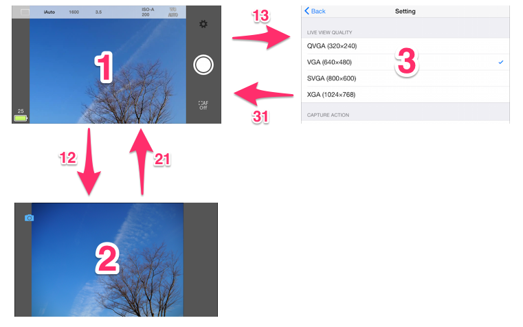
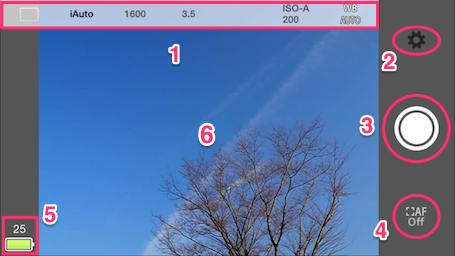
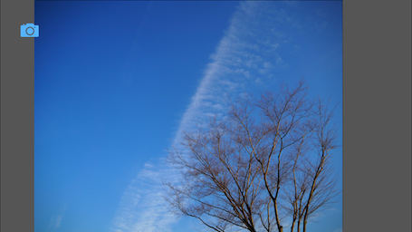
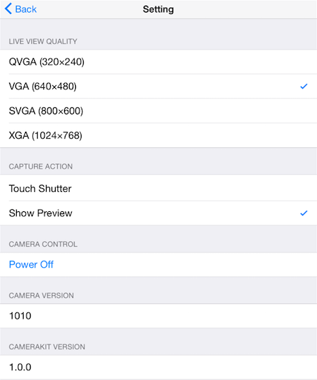

# Sample Capture App User Guide (iOS)

This document is an operation manual for ImageCaptureSample which uses Olympus Camera Kit for iOS. This document does not cover app installation or wireless connection between camera and mobile device. 

## Starting Application
+ Application will start by tapping icon of ImageCaptureSample in mobile device’s home screen.
+ Application starts communication with camera immediately after starting. 
+ Display of live view image will start. 

Note) This application is designed for landscape orientation only. Rotation of the mobile device is not supported. 

## Terminating Application
+ Press home button.
+ All communication stops when application terminates. 

## Screen Transition

+ 1)　Shooting Screen
+ 2)　Preview Screen
+ 3)　Setting Screen
+ 12)　Pressing Shutter Button
+ 21)　Tapping Camera Icon or Tapping Outside of Image
+ 13)　Tapping Setting Button
+ 31)　Tapping Back Button

## Shooting Screen

+ 1) Menu Bar
+ 2) Setting Button
+ 3) Shutter Button
+ 4) Auto Focus Lock Release Button  (enabled when touch shutter is disabled)
+ 5) Status Display
+ 6) Live View Image

---

+ Can shoot still and movie image.
+ Can shoot while watching live view image sent from camera in real time.

### Auto Focus (AF)
+ Auto focus at tapped point in auto focus enabled area, which is smaller rectangle inside live view image. The auto focus enabled area is invisible on this application.
+ If AF-supported micro four thirds lens is not mounted, AF does not work. 
+ Color of frame will be white during auto focus process.
+ When auto focus succeeds, a beep is made and frame color becomes green.
+ If you tap outside of auto focus enabled area, frame color becomes red.
+ If auto focus fails, error message is shown.
+ When touch shutter is enabled, picture is taken after AF. Otherwise, auto focus at the tapped position and lock focus position at the distance.
+ Tap Auto Focus Lock Release Button to unlock focus position.

### Shoot
+ By tapping shutter button, camera shoots an image regardless of touch shutter setting.
+ After shooting is complete, taken image is shown as a preview. In setting screen one can select whether to show preview image or not.
+ When touch shutter is enabled, take picture after AF. Otherwise, auto focus and lock focus position.

### Setting 

+ One can change shooting parameters by tapping menu bar displayed at top part of the screen. Following parameters can be changed from left to right.
	+ Drive Mode
		+ Single Shooting
			+ Shoot one image each by pressing shutter button.
		+ Continuous Shooting
			+ Shoot images continuously while shutter button is pressed.
			+ No preview images are shown even if preview setting is enabled.
		+ When shooting mode is Movie, Drive Mode setting is invalid. 
	+ Shooting Mode
		+ iAuto (Full Automatic Mode)
			+ Cannot change shutter speed, lens aperture, exposure compensation, ISO sensitivity, or white balance mode. 
		+ P (Program Auto Exposure Mode)
			+ Cannot change shutter speed or lens aperture.
		+ A (Aperture Priority Auto Exposure)
			+ Cannot change shutter speed. 
		+ S (Shutter Priority Auto Exposure)
			+ Cannot change lens aperture. 
		+ M (Manual Mode)
			+ Cannot change exposure compensation. 
		+ ART (Art Filter Mode)
			+ Shoot with art filter set on camera at the time. 
			+ Cannot change the art filter type.  
		+ Movie (Movie Capture Mode)
			+ Start taking movie by tapping shutter button. Stop taking movie by pressing shutter button again.
			+ Color of shutter button will be gray when shooting movie.
	+ Shutter Speed Value 
		+ Shutter speed value (set by user or camera) will be displayed in menu bar. 
		+ When long exposure value is set to camera, live view is not updated on screen after pressing shutter button during exposure time.
		+ Wait until exposure time elapses and app responds correctly.
	+ Lens Aperture Value 
		+ Lens aperture value (set by user or camera) will be displayed in menu bar. 
	+ Exposure Compensation Value
		+ Exposure compensation value (set by user or camera) will be displayed in menu bar.
	+ White Balance Mode
		+ Selected white balance mode will be displayed in menu bar. 
	+ ISO Sensitivity Value
		+ When AUTO is selected, ISO sensitivity value set by camera and text ISO-A will be displayed in menu bar.
		+ Otherwise, ISO sensitivity value will be displayed in menu bar.

### Status Display
+ Status of camera will be displayed at lower left part of screen. Following status is displayed from top to bottom. 
	+ Number of images that can fit in remaining memory. 
		+ Valid only for still images.
	+ Charge of camera battery. 
		+ Battery icon shows charge in three levels: full, middle, and low. 
		+ The icon shows the status of AC power supply.

### Move to Setting Screen
+ Enter setting screen by tapping the setting button, which is above the shutter button.

## Preview Screen 
+ Displays captured image. 
+ Go back to shooting screen by tapping camera icon or tapping area outside preview image. 

## Setting Screen
+ Current application settings are displayed. 

+ Can view and change following settings. 
	+ Live View Quality
		+ Select image size (quality) of live view image. 
			+ Lower resolution images (settings toward QVGA) have higher frame rate. 
			+ Higher resolution images (setting toward XGA) have lower frame rate. 
	+ Touch Shutter
		+ By selecting ON, touch shutter is enabled.
		+ By selecting OFF, touch auto focus is enabled.
		+ More detail is shown in Shooting Screen section. 
	+ Show Preview
		+ By selecting ON, preview image will be displayed after shooting.
		+ Preview image is displayed when Drive Mode is Single and Shooting Mode is not Movie.
		+ By selecting OFF, preview image will not be displayed after shooting.
	+ Power Off
		+ Can turn off power to the camera by tapping. 
	+ Camera Version
		+ Shows version of camera firmware.
	+ Camera Kit Version
		+ Shows version of Camera Kit that the application is using.

+ Parameters will be saved to application by pressing back button on top.

## In Case of Communication Error
+ An alert is displayed when a communication error occurs between camera and mobile device.
+ When alert is displayed, check the communication settings of OS and restart application.
