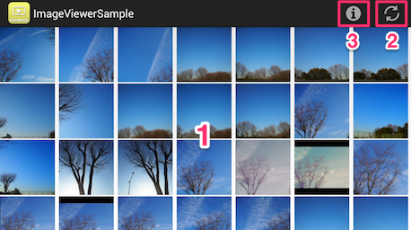
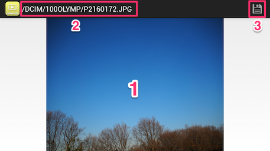
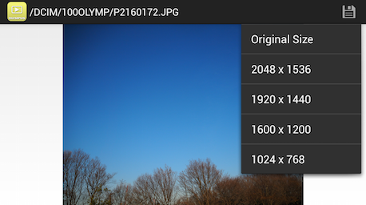

# Sample Viewer App User Guide (Android OS)

This document is an operation manual for ImageViewerSample which uses Olympus Camera Kit for Android OS. This document does not cover app installation or wireless connection between camera and mobile device. 

## Starting Application
+ Application will start by tapping icon of ImageViewerSample in mobile device’s home screen.
+ Application starts communication with camera immediately after starting. 
+ You can see thumbnail images downloaded from the camera memory.

Note) This application is designed for landscape orientation only. Rotation of the mobile device is not supported.

## Terminating Application
+ Press home button or back button (hardware button).
+ When the application exits, connection between mobile device and the camera is closed.

## Screen Transition

+ 1) Thumbnail List Screen
+ 2) Preview Screen
+ 12) Tapping a Thumbnail
+ 21) Tapping Back Button (hardware button)

## Thumbnail List Screen

+ 1) Thumbnail images
+ 2)  Reload button
+ 3) Information Button
---

+ This screen shows thumbnails of still images and videos in camera's memory card (under DCIM folder).
+ Thumbnails are shown in reverse chronological order.
+ Thumbnails for video are the video's first frame.
+ Thumbnails are reloaded by tapping "reload icon" on top of the screen.
+ If an thumbnail is tapped, the application moves to Preview Screen.
+ When Information Button tapped, versions of both camera firmware and Camera Kit will be shown.

##Preview Screen

+ 1) Preview image
+ 2) File name
+ 3) Save icon

---

+ The image selected in "Thumbnail List Screen" is previewed.
+ Only the first frame is previewed for the video files by the addition of film perforations to the top and bottom of the preview image.
+ Streaming video is not supported.
+ Filename is shown on top of the screen.
+ You can change the image’s scale by pinching. The magnitude of zoom is varied between the original size and fit-to-screen size. Double tap to toggle between the original size and fit-to-screen size.
+ Flick a preview image to display the previous or next image. There is no need to go back to Thumbnail List Screen.
+ A list of image sizes appears by tapping "save icon" on top of the screen. You can select one of the image sizes listed below.
	+ Original Size
	+ 2048×1536
	+ 1920×1440
	+ 1600×1200
	+ 1024×768

+ Tap an image size to transfer that sized image from the camera to the Android device’s Gallery.
+ Video transfer is not supported.
+ A message is shown after the image is transferred.
+ To move to Thumbnail List Screen, tap the back button (hardware button).

## In Case of Communication Error
+ An alert is displayed when a communication error occurs between camera and mobile device.
+ When alert is displayed, check the communication settings of OS and restart application.
